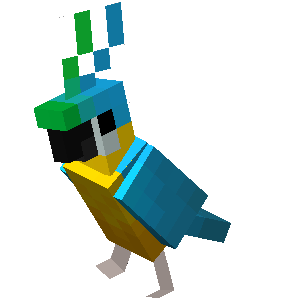

  

---

<h1 align="center">Halo, saya Faiz!</h1>
<h3 align="center">Pelajar SMAN 22 Gowa | 16 Tahun | Web Developer pemula</h3>

  

---

### 🚀 Tentang Saya
Saya Faiz, pelajar dari SMAN 22 Gowa seorang amateur di github. Suka belajar HTML, CSS,JavaScript dan suka banget ama pixelart . Lagi senang-senangnya bikin web !

---

### 🛠️ Skillset
- **Frontend**: HTML, CSS,
- **Tools**: Git & GitHub, VS 
- **Style**: UI Clean

---

### 🌟 Proyek Unggulan
- [**Quote Generator**](https://github.com/faiz448/quote-generator)  
  *Kumpulan kutipan pahlawan Yunani + terjemahan, desain elegan!*

---

### 📬 Kontak
- **Email**: faizazekk@Gmail.com
   
